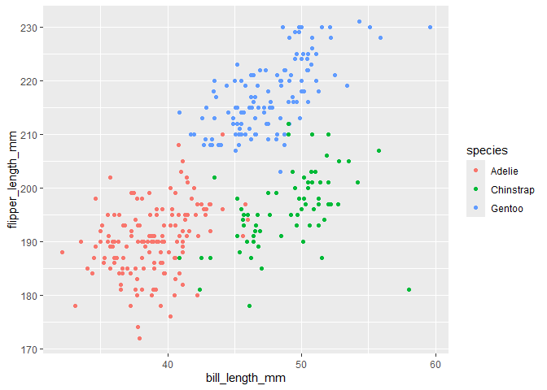

Homework1
================
Sarahy Martinez
2024-09-16

# Problem 1

Load the dataset

``` r
library(tidyverse)
```

    ## ── Attaching core tidyverse packages ──────────────────────── tidyverse 2.0.0 ──
    ## ✔ dplyr     1.1.4     ✔ readr     2.1.5
    ## ✔ forcats   1.0.0     ✔ stringr   1.5.1
    ## ✔ ggplot2   3.5.1     ✔ tibble    3.2.1
    ## ✔ lubridate 1.9.3     ✔ tidyr     1.3.1
    ## ✔ purrr     1.0.2     
    ## ── Conflicts ────────────────────────────────────────── tidyverse_conflicts() ──
    ## ✖ dplyr::filter() masks stats::filter()
    ## ✖ dplyr::lag()    masks stats::lag()
    ## ℹ Use the conflicted package (<http://conflicted.r-lib.org/>) to force all conflicts to become errors

``` r
data("penguins", package = "palmerpenguins")
```

Load library to allow for pull function, display the dataset, ,get the
number of rows and columns, find the mean flipper length

``` r
summary (penguins)
```

    ##       species          island    bill_length_mm  bill_depth_mm  
    ##  Adelie   :152   Biscoe   :168   Min.   :32.10   Min.   :13.10  
    ##  Chinstrap: 68   Dream    :124   1st Qu.:39.23   1st Qu.:15.60  
    ##  Gentoo   :124   Torgersen: 52   Median :44.45   Median :17.30  
    ##                                  Mean   :43.92   Mean   :17.15  
    ##                                  3rd Qu.:48.50   3rd Qu.:18.70  
    ##                                  Max.   :59.60   Max.   :21.50  
    ##                                  NA's   :2       NA's   :2      
    ##  flipper_length_mm  body_mass_g       sex           year     
    ##  Min.   :172.0     Min.   :2700   female:165   Min.   :2007  
    ##  1st Qu.:190.0     1st Qu.:3550   male  :168   1st Qu.:2007  
    ##  Median :197.0     Median :4050   NA's  : 11   Median :2008  
    ##  Mean   :200.9     Mean   :4202                Mean   :2008  
    ##  3rd Qu.:213.0     3rd Qu.:4750                3rd Qu.:2009  
    ##  Max.   :231.0     Max.   :6300                Max.   :2009  
    ##  NA's   :2         NA's   :2

``` r
penguins_rows = nrow(penguins)
penguins_column = ncol(penguins)
 
mean(pull(penguins, flipper_length_mm), na.rm = TRUE)
```

    ## [1] 200.9152

In the dataset we can find the species, island, bill length, bill depth,
flipper length, body mass, sex, and year. There are a total of 152
Adelie, 68 Chinstrap, and 124 Gentoo. There are also 165 females and 168
males. The size of the dataset is 344 and 8. The mean flipper length is
also 200.9152047.

Creating the scatterplot for penguins, load libraries to use function
for plot formation and ggsave to save plot

``` r
library(ggplot2)
library(palmerpenguins)

ggplot(drop_na(penguins), aes(x = bill_length_mm, y = flipper_length_mm, color = species)) + geom_point()
```

<!-- -->

``` r
ggsave("penguins_scatter.pdf")
```

# Problem 2

creating dataframe and calculating means

``` r
problem_2 = tibble(
  norm_samp = rnorm(10),
  norm_samp_pos = norm_samp >0,
  character_vec = c("A" ,"B" ,"C","D" ,"E" ,"F" ,"G" ,"I" ,"J" ,"K"),
  factor_vector =  factor(sample(c("Level1", "Level2", "Level3"), 10, replace = TRUE))
)

means = tibble(
  norm_samp_mean = mean(pull(problem_2, norm_samp)),
  norm_samp_pos_mean = mean(as.numeric(pull(problem_2, norm_samp_pos))),
  character_vec_mean = mean(as.numeric(pull(problem_2, character_vec))),
  factor_vector_mean = mean(as.numeric(pull(problem_2, factor_vector))),
)
```

What works when writing a code chunk that applies the as.numeric
function to the logical, character, and factor variable are the logical
and factor variable but not the character vector. The “as.numeric”
function is used to convert non-numerical values to numerical values. As
a result, we are able to convert factors and logical vectors to
numerical, however character cannot be transformed possibly due to
formatting or we need to apply as.character to transform the non-numeric
character into numerics.
